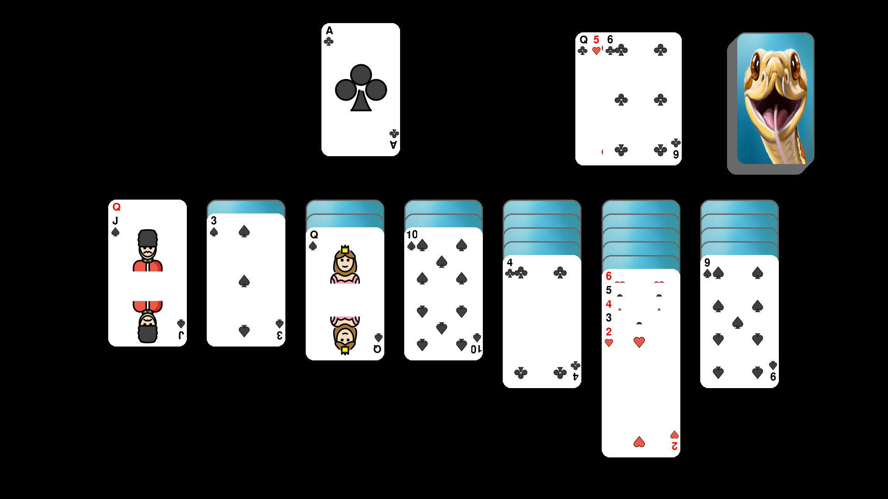

Examples
========

Solitaire
---------

This is an example of how a game of solitaire was created
using pygame.

If you can check the
`source code <https://github.com/ScienceGamez/pygame_cards/blob/master/examples/solitaire.py>`_ .
