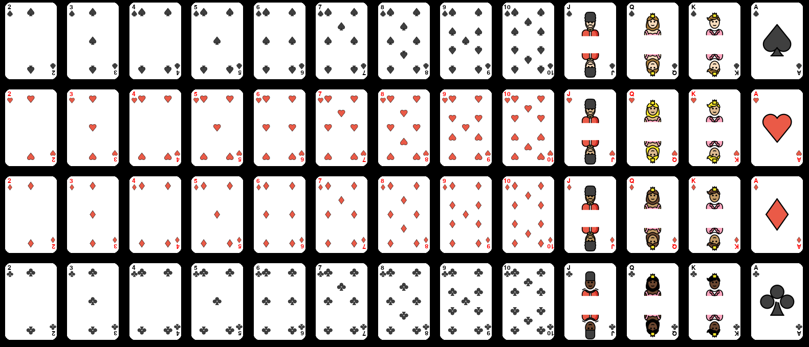

Existing Card Sets
==================

Classic Card set With Emojis
----------------------------

You can use the classic card loaded from emojis.

.. code-block::

    # Import the cardsets from the classic sets
    from pygame_cards.classics import CardSets

    # A set of 52 cards
    card_set = CardSets.n52

    # simply blit the graphics surface of the card
    surface.blit(card_set[0].graphics.surface)

.. note::

    This will generate automatically the cards
    at the requested dimension from svg emojis so you should
    have good graphics no matter the resolution.
