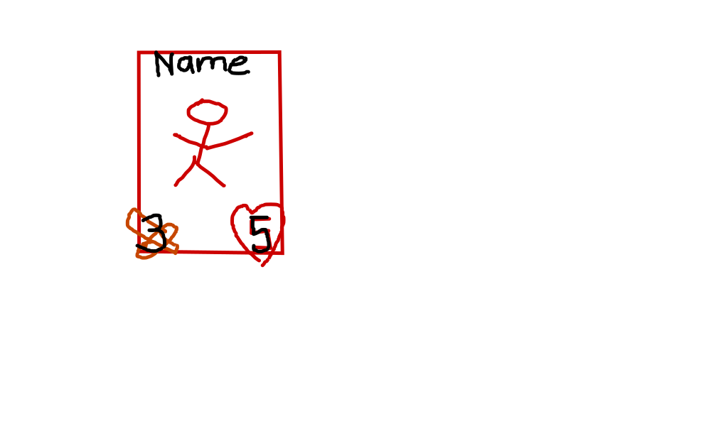
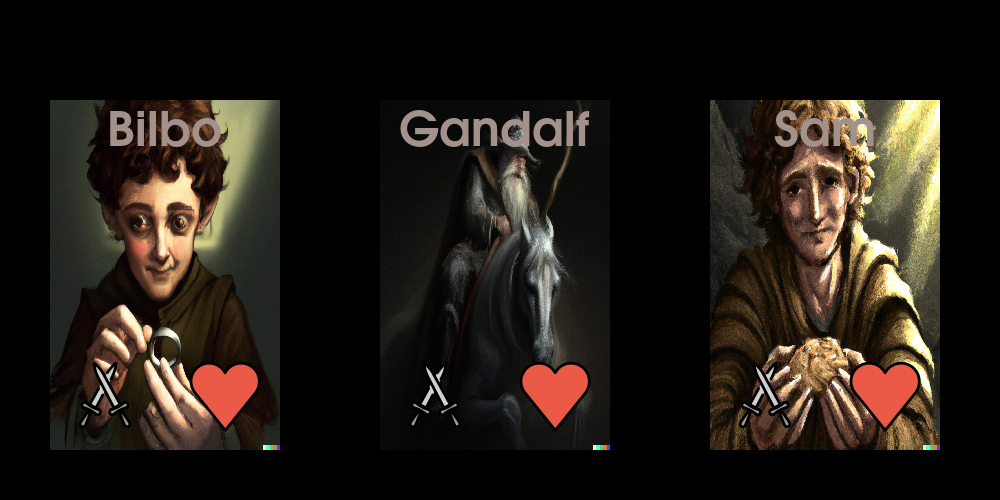

Tutorial
========

Using an existing card game
---------------------------

`pygame_cards` provides you with a base set of cards.

If you don't care about how one can create cards,
jump to :ref:`tuto_fist_card_game`

Creating a new card game
------------------------

The tutorial of pygame_cards will show you how to
make a simple card game.

As an example we will create a small minions game.
It will be something a bit similar to
`hearthstone <https://hearthstone.blizzard.com/>`_.

Creating your cards
^^^^^^^^^^^^^^^^^^^

First we will focus on designing our cards.

Inheriting from the Abstract Class
""""""""""""""""""""""""""""""""""

You need to define some fields for your card.
You can do that by inheriting from :py:class:`~pygame_cards.abstract.AbstractCard` .

It has only one mandatory argument which is `name` but we can add many others.

See the script below that generates a minion for you.

.. literalinclude:: ../examples/tutorial/minion_card.py
    :language: python

If you are not familiar with
`dataclasses <https://docs.python.org/3/library/dataclasses.html#module-dataclasses>`_
you can just
think that it helps you create instances as it creates the :py:func:`__init__`
for you.

We can see the the output of this script gives us ::

    MinionCard(name='Frodo the Hobbit', u_id=0, health=6, attack=2, cost=3)

We can see that a :py:attr:`u_id` field was created for us.
This is used to track every instance of a Card that is created during the
execution of the game.

Creating a set of Cards
"""""""""""""""""""""""

Now that we know how to create a card, we want to create all the content
we want.

For that we will use the Class :py:class:`~pygame_cards.set.CardsSet`.
You can use it like a python list:

.. literalinclude:: ../examples/tutorial/minion_set.py
    :language: python

Usually you will want to save your data in files instead of writing it
directly in python. For that you can use the :py:func:`pygame_cards.load.from_json`
method.

.. note::
    If you need specific capabilities in your CardSet based on your cards,
    you can inherit from this class and create your own.

Adding Graphics
"""""""""""""""

Now we are going to create graphics for our game.
When you do graphics, you will need some files for the content.
Just make sure that you don't used any copyrighted files you are not
allowed to.

For this tutorial, we will use two sources:
1. `pygame_emojis <https://github.com/ScienceGamez/pygame_emojis>`_ for the different art on the cards.
2. `DALL-E 2 <https://openai.com/dall-e-2/>`_ to produce some images of the lotr characters.

Let's start by thinking what we want on the card.
It is always a good idea to make a drawing first.

So basically attack and health points on the corners, the name on top
and an image in the middle of the card.

Let's now create the code for that.

We again can use the object oriented API to create a graphics object
suiting our need.
We will inherit from
:py:class:`~pygame_cards.abstract.AbstractCardGraphics`.

This class simply needs a :py:func:`surface` property.
We use python :py:func:`cached_property` so that once the
suface is created it will be used all the time and does not need to be
recreated at every game frame.

.. literalinclude:: ../examples/tutorial/minion_card_graphics.py
    :language: python

So we created a graphics for the cards and displayed it
on the screen.

Let's see the result:

Okay, this is quite ugly 😅. Now you can show your talent and
implement something better.

.. note::
    We did not use the attack and health fields, but this will
    come in a later tutorial.

`pygame_cards` provides you some functions to help you in the
creation of your cards.
But for now we will jump to the next section which is how
you can include your cards inside a game.

.. _tuto_fist_card_game:

Your First Card Game
--------------------

We will try to do a rock-paper-scisors like game using
lotr characters.

* Frodo > Gandalf because of the power of the ring.
* Gandalf > Sam becasue of the power of his wiseness.
* Sam > Frodo because of the power of friendship.

We are going to use different helpers to make cards management
easier.

* Cards and Oponents cards will be shown in a
    `pygame_cards.hands.HandsGraphics`
* Cards will be played on a `pygame_cards.set.Board`
* A winning animation will be done using the graphics class we created above
* Managing how the player select a card and plays it will be managed
    by a `pygame_cards.managers.GameManager`

The code looks like that with comments inside explaining what and why we do it:

You can actually improve it and I will update this tuto 😉.

.. literalinclude:: ../examples/tutorial/first_game.py
    :language: python

I hope you will find it easy to implement your own games.
